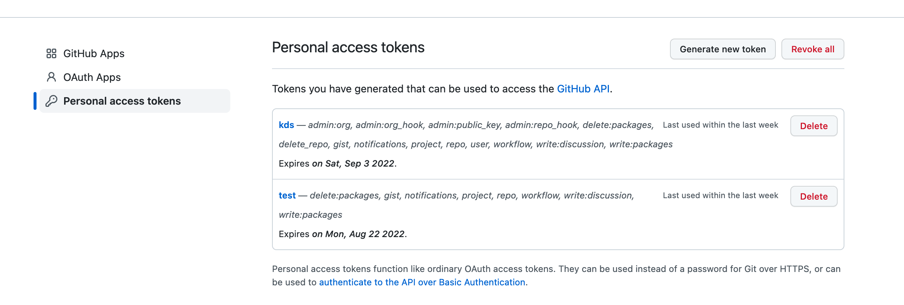

## authentication


```
export GH_TOKEN=
```

get them from https://github.com/settings/tokens

  

## graphql

https://docs.github.com/en/graphql/overview/explorer


## projects remarks

- https://docs.github.com/en/issues/planning-and-tracking-with-projects/automating-your-project/using-the-api-to-manage-projects#finding-the-node-id-of-a-user-project